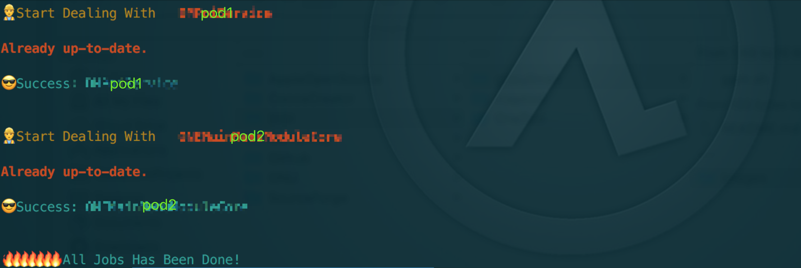

  

# Git Pull Man

#### This tool is using for `git pull`. When you have a lot pods in local path for development, you have to update them one by one and easy to forget which one has been forgotten.Maybe this will cause a compile error.Then GPM born!`iOS Only~ It's based on the podfile`.

#### When you run the `gpm` and you have uncommit code at this time.You have 5 choices Stash  Reset  Commit  Diff.

#### When you want to commit the code, then `gpm` will let you to input the commit message

#### Usage: `gpm ./pathOfPodfile`

#### When the `gpm` finished:

# Make Your Own Command With `gpm`
### 0. run `sudo chmod +x gpm.sh`

### 1. change your shell file name to the command name you want

### 2. delete the extend of the file (.sh)

### 3. copy this file to `/usr/local/bin`

### 4. run the command in terminal

Done, have fun : )

